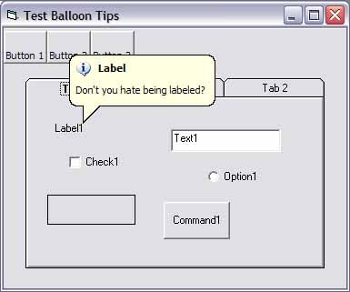



## Smart Popup Balloon Tips in VB

### Description

Add profressional 2000/XP style popup balloons to your project in seconds. Works with Win 98 and up, because this is a VB control that looks EXACTLY like the real thing! Plus only takes one line of code to add tips for standard controls!
 
### More Info
 

             |
---                |---
**Submitted On**   |2004-06-30 11:43:38
**By**             |[Johnny Tuttle](https://github.com/Planet-Source-Code/PSCIndex/blob/master/ByAuthor/johnny-tuttle.md)
**Level**          |Intermediate
**User Rating**    |5.0 (99 globes from 20 users)
**Compatibility**  |VB 6\.0
**Category**       |[Custom Controls/ Forms/  Menus](https://github.com/Planet-Source-Code/PSCIndex/blob/master/ByCategory/custom-controls-forms-menus__1-4.md)
**World**          |[Visual Basic](https://github.com/Planet-Source-Code/PSCIndex/blob/master/ByWorld/visual-basic.md)
**Archive File**   |[Smart\_Popu1764136302004\.zip](https://github.com/Planet-Source-Code/johnny-tuttle-smart-popup-balloon-tips-in-vb__1-54650/archive/master.zip)

